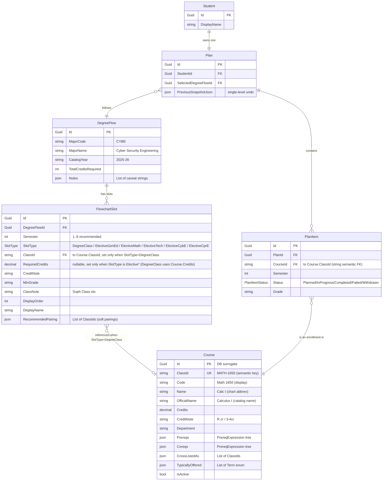

# ISU Course Manager — Design Spec

**Date:** 2026-05-12
**Status:** Approved for planning
**Author:** Kevin (with Claude)

## 1. Goals

Build an interactive degree-flow planner that helps an ISU student stay on track when reality deviates from the printed major flowchart. Each row of the flowchart is a semester; lines between courses are prereqs and coreqs. When a student misses a class, fails a class, or has a scheduling conflict, downstream courses cascade and the entire plan must be re-shaped.

The product takes that mental gymnastics off the student and presents a guided, visual experience.

**POC target user:** one student (Kevin's son) following the **Cyber Security Engineering (CybE) 2025-26** flowchart. Architecture must extend cleanly to multiple students and multiple majors.

**Future direction:** mobile app reusing the same API; intelligent elective recommendations; more majors; multi-flow overlays for major-change planning.

## 2. Scope

### In scope (POC)

- Single major: CybE 2025-26 only (data seed for one `DegreeFlow`).
- Single student, no multi-tenant UI.
- Stubbed JWT auth — middleware injects a fixed `studentId` claim. Real auth is a later swap.
- Hand-curated JSON seed files: one for the universal class registrar, one per `DegreeFlow`.
- Interactive plan view (UI layout chosen during implementation iteration).
- Direct CRUD for routine adds/drags/grade entries.
- Guided wizard for cascade-triggering events: skipped class, failed grade, withdrawal, explicit "replan from here," what-if major switch.
- Server-computed validation issues returned alongside every plan read.
- Single-level undo via plan snapshot.
- TDD-first development, especially the cascade engine.

### Out of scope (deferred)

- Real auth implementation; full JWT issuance/refresh.
- Live ISU catalog scraper (seed JSON only for now; scraper later).
- Section/time-conflict detection (only semester-level placement).
- Intelligent elective recommendation engine (placeholder slots only for POC).
- Multi-level undo / full audit trail.
- Print/PDF export, notifications, collaborative editing.
- Mobile client (API will be designed to support it; UI is web-only).
- Hosting/deployment hardening.

### Promoted in scope (was deferred)

- **Term-offering data** — needed because real ISU courses are Fall-only or Spring-only (e.g., COMS 3110, ENGL 3140 are Fall-only). The cascade engine must respect these when finding `earliestValidSemester`.
- **Cross-listings** — every CYBE course is cross-listed with a CPRE equivalent (CYBE 2300 = CPRE 2300, etc.). Taking either fulfills any slot referencing either. The data model and cascade engine must treat them as equivalent.
- **Classification gates** — the catalog encodes prereqs like "Sophomore classification" and "Junior classification" that aren't course-based. Modeled as a new prereq node type.

## 3. Architecture

### Stack

- **Frontend:** React + Vite + TypeScript SPA. Served separately during dev (Vite dev server, proxies `/api/*` to backend).
- **Backend:** ASP.NET Core Web API.
- **DB (POC):** SQLite, accessed via EF Core. Same EF code targets SQL Server in production (Azure or WinHost).
- **Auth:** JWT bearer middleware *stub* that injects a fixed `studentId` claim. Real JWT/claims implementation deferred.

### Backend project layout

Three projects with a clean dependency direction `Api → Services → Data`:

```
ISUCourseManager.sln
├── src/
│   ├── ISUCourseManager.Api/          ASP.NET Core entry, controllers, DI,
│   │                                  JWT-stub middleware, swagger, DTOs
│   ├── ISUCourseManager.Services/     business logic — PlanService,
│   │                                  CascadeEngine, PrereqEvaluator,
│   │                                  CatalogService, IPlanRepository, ...
│   └── ISUCourseManager.Data/
│       ├── Entity/                    POCO entities (Course, DegreeFlow,
│       │                              FlowchartSlot, Plan, PlanItem, Student)
│       ├── Configurations/            EF Fluent API configs
│       ├── Repositories/              EF implementations of I*Repository
│       ├── Migrations/
│       ├── Seed/
│       │   ├── isu-catalog.json
│       │   ├── flow-cybe-2025-26.json
│       │   └── JsonSeedLoader.cs
│       └── ApplicationDbContext.cs
├── tests/
│   ├── ISUCourseManager.Services.Tests/   xUnit + FluentAssertions
│   └── ISUCourseManager.Api.Tests/        WebApplicationFactory + SQLite-in-memory
└── web/                                   React + Vite + TS (own package.json)
```

### Component diagram

```
┌─────────────────────────┐         ┌──────────────────────────────────────┐
│   React + Vite + TS     │  HTTPS  │       ASP.NET Core Web API           │
│   (browser SPA)         │ ◄─────► │  Controllers (thin)                  │
│   - Plan view           │  REST   │       │                              │
│   - Wizard modals       │  JSON   │       ▼                              │
│   - Catalog browser     │         │  Services (PlanService, CascadeEngine,│
│   - Major switcher      │         │            PrereqEvaluator, ...)     │
└─────────────────────────┘         │       │                              │
                                    │       ▼                              │
                                    │  Repositories (EF Core)              │
                                    │       │                              │
                                    │       ▼                              │
                                    │  ApplicationDbContext → SQLite       │
                                    └──────────────────────────────────────┘
                                                ▲
                                                │ seeded once on startup
                                  ┌─────────────┴──────────────┐
                                  │  isu-catalog.json          │
                                  │  flow-cybe-2025-26.json    │
                                  └────────────────────────────┘
```

## 4. Domain Model

Three tiers, each with a different update cadence and authority.

### Tier 1: Class Registrar (universal facts)

The full ISU catalog of courses. Read-mostly. Same data regardless of major.

```csharp
class Course {                    // table: courses
  Guid Id;                // surrogate primary key (DB)
  string ClassId;         // "MATH-1650" — stable semantic key, referenced from
                          //   slots, prereq trees, cross-listings, and PlanItem
  string Code;            // "Math 1650" — display string (chart format)
  string Name;            // "Calc I" — chart abbreviation, used in UI tiles
  string? OfficialName;   // "Calculus I" — catalog name, used in detail views
  decimal Credits;
  string? CreditNote;     // "R cr", "3/4cr"
  string Department;      // "Math", "CprE", ...
  PrereqExpression? Prereqs;     // tree, JSON column
  PrereqExpression? Coreqs;      // tree, JSON column
  List<string> CrossListedAs;    // ["CPRE-2300"] for CYBE-2300 — same physical course
  List<Term> TypicallyOffered;   // [Fall, Spring] — empty list = unknown / assume all
  bool IsActive;
}

enum Term { Fall, Spring, Summer }
```

**Identifier model:** `ClassId` (e.g., `MATH-1650`) is the stable semantic key — it appears in seed JSON files, in cross-references between courses, and in slot references. `Id` is the DB surrogate. `Code` (e.g., `Math 1650`) is the human-readable display string. The seed loader treats `ClassId` as the canonical reference; EF Core uses `Id` for joins.

**Cross-listing semantics:** if `CourseA.CrossListedAs` contains `CourseB.Code`, then completing either course satisfies any prereq, coreq, or `FlowchartSlot` reference to either. The cascade engine and `PrereqEvaluator` consult an equivalence-class map built from the `CrossListedAs` graph at startup. UI shows the "primary" code (the one in the slot) but lets users mark completion under any equivalent code.

**Prereq expression tree** handles AND/OR/grade gates and classification gates:

```csharp
abstract class PrereqExpression { }
class PrereqAnd            : PrereqExpression { List<PrereqExpression> Children; }
class PrereqOr             : PrereqExpression { List<PrereqExpression> Children; }
class PrereqCourse         : PrereqExpression {
  Guid CourseId;
  string? MinGrade;             // "C-" or null
  bool AcceptConcurrent;        // for "Cr or enrollment in X"
}
class PrereqClassification : PrereqExpression { Classification Min; }
class PrereqCoreCredits    : PrereqExpression { decimal MinCoreCredits; }   // e.g., "29 Core Cr" gate on CprE 4910

enum Classification { Freshman, Sophomore, Junior, Senior }
```

Stored as a JSON column on `Course`.

### Worked example: a real Course populated end-to-end

To make the abstract schema concrete, here's how `CPRE 4940 (Portfolio Assessment)` looks fully populated. The ISU catalog text reads:

> **CPRE 4940: Portfolio Assessment** (Cross-listed with EE 4940). Credits: Required. Contact Hours: Lecture 1.
> **Prereq:** CPRE 2320 or EE 2320 or CYBE 2340; credit or concurrent enrollment in CPRE 4910 or EE 4910

That single catalog "Prereq:" line decomposes naturally into two of our schema fields — the **completed-course requirement** goes in `Prereqs`, and the **must-take-this-term** part goes in `Coreqs`.

#### As a C# object literal

```csharp
var cpre4940 = new Course
{
    Id = Guid.Parse("..."),                 // assigned by EF
    ClassId = "CPRE-4940",
    Code = "CprE 4940",
    Name = "Portfolio",                     // chart abbreviation
    OfficialName = "Portfolio Assessment",
    Credits = 0m,
    CreditNote = "R cr",                    // "Required" credit
    Department = "CprE",

    // "CPRE 2320 or EE 2320 or CYBE 2340" — must have completed one of these
    Prereqs = new PrereqOr
    {
        Children =
        {
            new PrereqCourse { ClassId = "CPRE-2320" },
            new PrereqCourse { ClassId = "EE-2320" },
            new PrereqCourse { ClassId = "CYBE-2340" },
        },
    },

    // "credit or concurrent enrollment in CPRE 4910 or EE 4910" — must take same/earlier term
    Coreqs = new PrereqOr
    {
        Children =
        {
            new PrereqCourse { ClassId = "CPRE-4910", AcceptConcurrent = true },
            new PrereqCourse { ClassId = "EE-4910",   AcceptConcurrent = true },
        },
    },

    CrossListedAs = new() { "EE-4940" },
    TypicallyOffered = new() { Term.Fall, Term.Spring },
    IsActive = true,
};
```

#### As JSON (the seed-file representation)

```jsonc
{
  "classId": "CPRE-4940",
  "code": "CprE 4940",
  "name": "Portfolio",
  "officialName": "Portfolio Assessment",
  "credits": 0,
  "creditNote": "R cr",
  "department": "CprE",

  "prereqs": {
    "type": "Or",
    "children": [
      { "type": "Course", "classId": "CPRE-2320" },
      { "type": "Course", "classId": "EE-2320" },
      { "type": "Course", "classId": "CYBE-2340" }
    ]
  },

  "coreqs": {
    "type": "Or",
    "children": [
      { "type": "Course", "classId": "CPRE-4910", "acceptConcurrent": true },
      { "type": "Course", "classId": "EE-4910",   "acceptConcurrent": true }
    ]
  },

  "crossListedAs": ["EE-4940"],
  "typicallyOffered": ["Fall", "Spring"],
  "isActive": true
}
```

#### How the cascade engine reads this

When the engine evaluates whether `CPRE-4940` can be placed in semester N for a given student:

1. **Prereqs check (Or):** at least one of `CPRE-2320`, `EE-2320`, or `CYBE-2340` must be `Completed` in a `PlanItem` with semester < N. Cross-listing equivalence applies — a student who took `CYBE-2340` satisfies any reference to `CPRE-2340` (and vice versa).
2. **Coreqs check (Or with `acceptConcurrent`):** at least one of `CPRE-4910` or `EE-4910` must be in a `PlanItem` with semester ≤ N (because `acceptConcurrent: true` means "or enrolled in this term").
3. If both pass, the placement is valid. If either fails, the engine returns `NoValidSemester` for the candidate, advances to N+1, and retries.

#### Other realistic shapes you'll see in the catalog

| Catalog text | Tree shape |
|---|---|
| (no prereq) | `Prereqs = null` |
| "MATH 1650" | `PrereqCourse { ClassId = "MATH-1650" }` |
| "Minimum C- in MATH 1650" | `PrereqCourse { ClassId = "MATH-1650", MinGrade = "C-" }` |
| "credit or enrollment in MATH 1660" | `PrereqCourse { ClassId = "MATH-1660", AcceptConcurrent = true }` |
| "CPRE 308 or COMS 252 or COMS 352" | `PrereqOr { Children = [Course CPRE-3080, Course COMS-2520, Course COMS-3520] }` |
| "MATH 1650 AND credit or concurrent in MATH 1660" | `PrereqAnd { Children = [Course MATH-1650, Course(MATH-1660, AcceptConcurrent=true)] }` |
| "Sophomore classification" | `PrereqClassification { Min = Sophomore }` |
| "29 Core Cr" (CprE 4910 chart annotation) | `PrereqCoreCredits { MinCoreCredits = 29 }` |
| "(MATH 1660 or 1660H); (MATH 2010 or COMS 2300)" | `PrereqAnd { Children = [Or(MATH-1660, MATH-1660H), Or(MATH-2010, COMS-2300)] }` |

The expression tree composes arbitrarily deep: an `And` can contain `Or`s containing `Course`s with `MinGrade` and `AcceptConcurrent` flags. The catalog seed file's 12 `_unparsed` entries are the strings the auto-extractor couldn't decompose; they round-trip via the `PrereqUnparsed` escape-hatch node and surface as warnings during validation.

### Tier 2: DegreeFlow (per-flow recommended ordering)

A specific major+catalog year. Multiple `DegreeFlow`s can coexist; the same `Course` rows are referenced by all of them. Switching majors = rendering the same plan against a different `DegreeFlow`.

```csharp
class DegreeFlow {                // table: degree_flows
  Guid Id;
  string MajorCode;       // "CYBE"
  string MajorName;       // "Cyber Security Engineering"
  string CatalogYear;     // "2025-26"
  int TotalCreditsRequired;
}

class FlowchartSlot {             // table: flowchart_slots
  Guid Id;
  Guid DegreeFlowId;
  int Semester;                   // recommended placement (1..8)
  SlotType SlotType;              // single enum captures both "is this a specific class
                                  //   or a placeholder?" and "if placeholder, which category?"
  string? ClassId;                // populated when SlotType == DegreeClass
                                  //   (refers to Course.ClassId, e.g. "MATH-1650")
  decimal? RequiredCredits;       // null when SlotType == DegreeClass — credits come from
                                  //   Course.Credits via the ClassId join. Set on Elective*
                                  //   slots to declare the credit budget the user must fill.
  string? CreditNote;             // "R cr", "3/4cr" — chart-specific display annotation
  string? MinGrade;               // grade requirement specific to this flow
  string? ClassNote;              // "Soph Class", "Junior Class", "Requires 29 Core Credits"
  int DisplayOrder;
  string? DisplayName;            // optional override of Course.Name for this slot's tile
  List<string> RecommendedPairing; // chart's red-solid lines: this flow recommends taking
                                  //   these courses in the same semester. Soft hint to the
                                  //   cascade engine (warning, not a hard block).
}

/// <summary>
/// What this flowchart slot is asking for. DegreeClass = a specific required course
/// (set ClassId). The Elective* values are placeholders the user fills with their
/// own choice from the catalog, filtered to that category. The cascade engine and
/// category-search queries switch on this single enum.
/// </summary>
enum SlotType
{
    DegreeClass,        // specific required course (ClassId is populated)
    ElectiveGenEd,      // any approved general-education elective (3 cr typical)
    ElectiveMath,       // any approved math elective
    ElectiveTech,       // any approved technical elective (open list)
    ElectiveCybE,       // any approved Cyber Security Engineering elective
    ElectiveCprE,       // any approved Computer Engineering elective
}
```

**Why one enum instead of two fields:** The previous design had `Kind: SlotKind { FixedClass, CategoryChoice }` plus a separate `Category: string?`. That allowed invalid combinations to be representable (e.g. `Kind=FixedClass` with `Category="GenEdElective"`) and forced the cascade engine to switch on two correlated fields. Collapsing them into a single typed enum makes the slot's purpose self-documenting and lets the engine drive category-search queries (`"give me all courses eligible for this slot"`) directly off the enum value via a `CategoryFor(SlotType)` mapping.

**Why `RequiredCredits` is nullable:** For `DegreeClass` slots the credit value already lives on `Course.Credits` (e.g., MATH-1650 = 4 cr). Duplicating it on the slot creates drift risk. For `Elective*` slots there's no specific course yet, so the slot itself must declare the credit budget the user must satisfy when they fill it. The validator computes a flow's total credits as `sum(Course.Credits for DegreeClass slots) + sum(slot.RequiredCredits for Elective slots)`.

**No `Prereqs` or `Coreqs` on `FlowchartSlot`** — those live on `Course` (Tier 1, the catalog) as the single source of truth. The catalog's prereq trees encode hard coreqs via `acceptConcurrent: true` flags on `PrereqCourse` nodes (matching ISU's "credit or concurrent enrollment in X" phrasing). The flow's `RecommendedPairing` captures the chart's *curriculum-recommended* pairings that aren't catalog-enforced (e.g., CprE 1850 + Math 1650: catalog allows either-or via placement, chart recommends taking them together).

`DegreeFlow` also gets a top-level `Notes: List<string>` for the chart's caveat list ("This flowchart is only a guide…", etc.).

**File format:**

```jsonc
// flow-cybe-2025-26.json
{
  "code": "CYBE",
  "name": "Cyber Security Engineering",
  "catalogYear": "2025-26",
  "totalCreditsRequired": 125,
  "notes": [
    "This flowchart is only a guide. ...",
    "Lab and lecture must be passed in the same semester ..."
  ],
  "slots": [
    { "semester": 1, "slotType": "DegreeClass", "classId": "MATH-1650",
      "name": "Calc I", "requiredCredits": 4, "minGrade": "C-", "displayOrder": 1 },
    { "semester": 1, "slotType": "DegreeClass", "classId": "CPRE-1850",
      "name": "CprE Prob Solv", "requiredCredits": 3, "displayOrder": 3,
      "recommendedPairing": ["MATH-1650"] },
    { "semester": 1, "slotType": "ElectiveGenEd",
      "requiredCredits": 3, "displayOrder": 5 },
    // ...
  ]
}
```

**No `prereqs` or `coreqs` per slot** — those live on `Course` (Tier 1). Importer ensures each `classId` exists in `courses`, then inserts `DegreeFlow` + `FlowchartSlot` rows.

### Tier 3: Student Plan (the user's xref)

```csharp
class Student { Guid Id; string DisplayName; }

class Plan {                      // table: plans
  Guid Id;
  Guid StudentId;
  Guid SelectedDegreeFlowId;      // the flow they're following
  string? PreviousSnapshotJson;   // for single-level undo
}

class PlanItem {                  // table: plan_items — the xref
  Guid Id;
  Guid PlanId;
  string CourseId;                // matches Course.ClassId (e.g., "MATH-1650")
                                  //   — string semantic FK, not Guid surrogate FK,
                                  //   so PlanItems are stable across catalog re-seeds
  int Semester;                   // past, present, or future
  PlanItemStatus Status;          // Planned | InProgress | Completed | Failed | Withdrawn
  string? Grade;                  // populated for Completed/Failed
}

enum PlanItemStatus { Planned, InProgress, Completed, Failed, Withdrawn }
```

The `PlanItem` table holds the student's full academic record: prior semesters (`Status = Completed/Failed`), current semester (`Status = InProgress`), and future plans (`Status = Planned`).

### Visual ER diagram



**Notes on the diagram:**

- **Three tiers, color-coded by purpose** (not visible in pure ER but follows the entity grouping):
  - Tier 1 (read-mostly catalog): `Course`
  - Tier 2 (per-flow recommendation): `DegreeFlow`, `FlowchartSlot`
  - Tier 3 (per-student state): `Student`, `Plan`, `PlanItem`
- **`json` columns are EF Core JSON columns**, not separate tables. `CrossListedAs`, `RecommendedPairing`, `Prereqs`, `Coreqs`, `Notes`, `TypicallyOffered` are all stored as JSON. They could be normalized into join tables in a future plan if query patterns demand it (e.g., "find every course that lists X as a prereq"), but for the POC the JSON shape is simpler and matches the seed-file format.
- **`FlowchartSlot.ClassId` and `PlanItem.CourseId` are string semantic FKs** referencing `Course.ClassId`, not surrogate-key joins on `Course.Id`. This makes plans and slots survive `Course` row re-seeds (the ClassId stays stable; the surrogate Guid does not).
- **Cross-listings are not enforced by the DB.** The validator and the cascade engine consult the `Course.CrossListedAs` JSON list at runtime; equivalence is computed in-memory.

### Why this tiering matters

- **Switching majors is just a different lens.** No data moves; only the rendered overlay changes.
- **Catalog-prereqs are canonical.** Cascade engine reads them from `Course`, never from a flow file. A flow file may include them (for self-containment) but they're validated on import.
- **A `PlanItem` doesn't know which flow slot it satisfies.** That mapping is computed fresh on render — keeps invariants simple, no stale bindings to invalidate.

## 5. Cascade Engine

Pure C# in `Services/`. No DB, no I/O, no clocks. Given `(Plan, DegreeFlow, Catalog, Trigger) → CascadeProposal`. Never persists; the controller calls the engine, then `PlanService.Apply()` does the writes.

### Inputs

```csharp
class CascadeRequest {
  Plan CurrentPlan;
  DegreeFlow ActiveFlow;
  IReadOnlyList<Course> Catalog;        // every course referenced
  CascadeTrigger Trigger;
  CascadeOptions Options;               // target/cap credits per semester
}

abstract class CascadeTrigger { }
class CourseFailed         : CascadeTrigger { Guid PlanItemId; string Grade; }
class CourseSkipped        : CascadeTrigger { Guid PlanItemId; int? RescheduledTo; }
class CourseAddedToSem     : CascadeTrigger { Guid CourseId; int Semester; }
class CourseRemovedFromSem : CascadeTrigger { Guid PlanItemId; }
class CourseSubstituted    : CascadeTrigger { Guid PlanItemId; Guid NewCourseId; }
class WhatIfMajorSwitched  : CascadeTrigger { Guid NewDegreeFlowId; }
```

### Algorithm

1. Apply the trigger event to a working copy of the plan.
2. Compute the **affected set** — walk the prereq DAG forward from the triggering course; any `PlanItem` with broken prereqs joins the set.
   - When evaluating "is course X completed," consult the cross-listing equivalence class — taking `EE 4910` satisfies any reference to `CPRE 4910`.
   - Classification gates (`PrereqClassification`) are evaluated against the student's projected classification at the candidate semester (Sophomore = ≥ 30 credits earned, Junior = ≥ 60, Senior = ≥ 90 — configurable via `CascadeOptions`).
   - Core-credit gates (`PrereqCoreCredits`, e.g. CprE 4910's "29 Core Cr") are evaluated against the running total of credits earned in courses tagged with the program's core categories.
3. For each affected `PlanItem`, find `earliestValidSemester` — the first semester ≥ current where:
   - All prereqs are completed (or scheduled in an earlier semester).
   - Hard coreqs (catalog-derived `acceptConcurrent: true` references) are scheduled in the same or earlier semester.
   - Grade requirements on prereqs are satisfiable.
   - **Term-offering constraint**: the candidate semester's term (Fall/Spring/Summer) is in `Course.TypicallyOffered` (if non-empty). If the candidate term is unavailable, advance to the next valid term.
4. Topologically order moves so dependencies are placed before dependents.
5. Detect resulting per-semester state — emit `FillGapDecision` for under-credit semesters, `SemesterOverload` warning for over-credit semesters.
6. **Soft-pairing pass**: for every PlanItem in a `RecommendedPairing`, check whether its paired item is still in the same semester. If not, emit `RecommendedPairingBroken` warning and offer a `ReunitePairing` decision (move the orphan to keep the pairing intact). User can accept or override.
7. Return the `CascadeProposal` — never mutate persistent state.

**Semester-to-term mapping:** `CascadeOptions` carries the `StartTerm` (Fall or Spring) and the engine alternates from there. E.g., `StartTerm = Fall` → Sem 1 = Fall, Sem 2 = Spring, Sem 3 = Fall, etc. Summer is never auto-assigned but the user can manually place items in Summer slots.

### Outputs

```csharp
class CascadeProposal {
  Plan ProposedPlan;
  IReadOnlyList<CascadeMove> Moves;
  IReadOnlyList<DecisionPoint> Decisions;
  IReadOnlyList<Warning> Warnings;
  int ProjectedGraduationSemester;
}

class CascadeMove {
  Guid PlanItemId; string CourseCode;
  int FromSemester, ToSemester;
  string Reason;
}

abstract class DecisionPoint { Guid Id; int Semester; string Prompt; }
class FillGapDecision        : DecisionPoint {
  decimal CreditsToFill; List<SlotOption> SuggestedSlots;
}
class ChooseElectiveDecision : DecisionPoint {
  string Category; List<Course> Candidates;
}
class ConfirmOverloadDecision: DecisionPoint {
  decimal CurrentCredits; decimal SoftCap; List<MovableItem> CanDeferToLater;
}

class Warning { WarningKind Kind; string Message; List<Guid> RelatedPlanItemIds; }
enum WarningKind { SemesterOverload, GraduationPushed, GradeRequirementUnmet, NoValidSemester, RecommendedPairingBroken }

// Supporting types referenced by DecisionPoint subclasses:
class SlotOption {              // a generic flowchart-slot suggestion to fill a gap
  string Category;              // "GenEd", "TechElective", ...
  decimal Credits;
}
class MovableItem {             // a PlanItem the user could defer to alleviate overload
  Guid PlanItemId; string CourseCode; decimal Credits;
  int EarliestPossibleSemester; // engine-computed alternative placement
}
```

### Acceptance criteria (each becomes one or more cascade-engine tests)

**Skip a course:**
- **AC-1** Math 1650 skipped in Sem 1, no reschedule given → engine moves Math 1650 to next valid semester (Sem 2), pushes CprE 1850 (coreq) to Sem 2, pushes Math 1660 (prereq) to Sem 3, emits `FillGapDecision { Sem 1, ~7cr }`.
- **AC-2** Math 1650 skipped, user explicitly reschedules to Sem 3 (not 2) → all dependents push proportionally further; engine respects the user's chosen semester.
- **AC-3** A pure gen-ed slot skipped (no downstream prereqs) → emits `FillGapDecision` for that semester only; no moves elsewhere.

**Fail a course:**
- **AC-4** Math 1650 graded D (need C-) → engine flags `GradeRequirementUnmet`, schedules retake at next valid semester, cascades dependents identically to AC-1.
- **AC-5** CprE 2810 failed in Sem 3 → all CprE 28xx-dependents downstream re-plan; engine reports each move with reason.
- **AC-6** Course retaken successfully on second attempt → cascade unwinds; dependents may shift back to earlier semesters if now eligible.

**Substitute / swap:**
- **AC-7** Replace one Tech Elective with another with equivalent prereqs → no cascade moves; only the swap is recorded.
- **AC-8** Replace where new course has stricter prereqs that aren't satisfied → cascade triggered; downstream items re-evaluated.

**Add / remove:**
- **AC-9** User adds a fixed course earlier than its canonical semester (and prereqs allow it) → downstream dependent courses may shift earlier (good news case); engine reports the moves.
- **AC-10** User removes a backfill gen-ed → re-emits `FillGapDecision` for that semester.

**Overload / underload:**
- **AC-11** Cascade results in Sem 2 = 22 credits → `SemesterOverload` warning + `ConfirmOverloadDecision` listing courses that could defer.
- **AC-12** Cascade leaves Sem 1 with 6 credits (below soft minimum) → `FillGapDecision`.

**Boundary / failure cases:**
- **AC-13** Cascade pushes a course past Sem 8 → `GraduationPushed` warning, `ProjectedGraduationSemester = 9` (or appropriate).
- **AC-14** A required course's prereqs are not satisfiable in any future semester → `NoValidSemester` warning; no infinite loop.
- **AC-15** Circular prereq encountered (data error) → engine surfaces a clear error rather than spinning.

**Multi-major / overlay (forward-looking, tested now to keep the model honest):**
- **AC-16** `WhatIfMajorSwitched` to a different `DegreeFlow` → produces an overlay proposal: which `PlanItem`s map to which slots in the new flow, what's missing, what's surplus. No mutation of stored plan.
- **AC-17** Same `Plan` overlaid against two different `DegreeFlow`s → overlays computed independently, no shared state leakage.

**Cross-listing equivalence:**
- **AC-19** Student took `EE 4910` (a cross-listing of `CPRE 4910`) → engine treats CPRE 4910 slot as filled by EE 4910 PlanItem; downstream prereqs referencing CPRE 4910 are satisfied.
- **AC-20** Slot references `CYBE 2310`; student has CPRE 2310 in their PlanItems → overlay correctly maps CPRE 2310 to the slot.

**Soft pairings (recommendedPairing):**
- **AC-26** CprE 1850 (Sem 1) has `recommendedPairing: [MATH-1650]`. User skips Math 1650 from Sem 1 → catalog allows CprE 1850 to remain (placement OR Math 1430 OR Math 1650). Engine emits `RecommendedPairingBroken` warning + `ReunitePairing` decision suggesting CprE 1850 also move to wherever Math 1650 went. User can accept (move both) or override (leave CprE 1850 in Sem 1).
- **AC-27** Hard coreq from catalog (e.g., PHYS 2310 ↔ PHYS 2310L via `acceptConcurrent`) → enforced as a hard placement constraint, NOT a soft pairing warning. Cascade engine *blocks* placements that violate it.

**Term offerings:**
- **AC-21** Cascade tries to place COMS 3110 (Fall-only) into a Spring semester → engine advances to next Fall term and reports the move with reason "term-offering constraint."
- **AC-22** Course with empty `TypicallyOffered` is treated as available every term (back-compat for partial catalog data).

**Classification gates:**
- **AC-23** `PrereqClassification(Sophomore)` on CPRE 2810 → engine projects classification at candidate semester from cumulative credits; rejects placement when projected classification < required.
- **AC-24** Cumulative credits computed from completed PlanItems + planned earlier-semester PlanItems → consistent with how `earliestValidSemester` walks forward.

**Core-credit gates:**
- **AC-25** `PrereqCoreCredits(29)` on CprE 4910 → engine sums credits from PlanItems whose Course's category is part of the program's core (per `MajorPath.CoreCategories`); blocks placement until threshold is met.

**Validation entry point (used by every read):**
- **AC-18** `Engine.Validate(plan, flow)` returns the same set of issues that would be detected if every PlanItem were re-checked individually — exhaustive and consistent with cascade behavior. Includes cross-listing, term-offering, and classification-gate checks.

## 6. API Surface

REST + JSON. Base path `/api/v1`. Behind JWT-stub middleware; `User.FindFirst("studentId")` is the active student.

```
GET    /api/v1/catalog/courses            → CourseDto[]
GET    /api/v1/catalog/courses/{id}       → CourseDetailDto
GET    /api/v1/catalog/courses?dept=CprE  (optional filter)

GET    /api/v1/flows                      → DegreeFlowSummaryDto[]
GET    /api/v1/flows/{id}                 → DegreeFlowDetailDto

GET    /api/v1/me                         → StudentDto
GET    /api/v1/me/plan                    → PlanDto (with PlanItems + ValidationIssues)
PUT    /api/v1/me/plan                    → PlanDto (e.g., switch SelectedDegreeFlowId)

GET    /api/v1/me/plan/items              → PlanItemDto[]
POST   /api/v1/me/plan/items              → PlanDto (with refreshed ValidationIssues)
PUT    /api/v1/me/plan/items/{id}         → PlanDto
DELETE /api/v1/me/plan/items/{id}         → 204

POST   /api/v1/cascade/preview            → CascadeProposalDto
POST   /api/v1/cascade/apply              → PlanDto (committed)
```

### Cascade preview/apply: stateless iteration

The wizard is client-orchestrated. The client carries the trigger and accumulating answers; each `/preview` call narrows the proposal until `decisions` is empty, then `/apply` commits.

```jsonc
// POST /api/v1/cascade/preview
{
  "trigger": { "type": "CourseSkipped", "planItemId": "...", "rescheduledTo": null },
  "decisionAnswers": [
    { "decisionId": "fillgap-sem1", "answer": { "kind": "UseSuggestedSlots" } }
  ]
}
```

```jsonc
// response
{
  "proposedPlan": { /* hypothetical Plan + items */ },
  "moves": [
    { "planItemId": "...", "courseCode": "CprE 1850", "from": 1, "to": 2,
      "reason": "Coreq Math 1650 moved to Sem 2" }
  ],
  "decisions": [],          // empty when ready to apply
  "warnings": [
    { "kind": "SemesterOverload", "message": "Sem 2 = 22 cr (cap 18)",
      "relatedPlanItemIds": [...] }
  ],
  "projectedGraduationSemester": 9
}
```

`/apply` accepts the same body shape, runs the engine once more for safety, persists in a transaction, and returns the new `PlanDto`. Returns 409 if server state has changed since the preview.

### Cross-cutting

- `ProblemDetails` (RFC 7807) for errors.
- `FluentValidation` for request DTOs; failures → 400 with field-level details.
- CORS allows the React dev server (`http://localhost:5173`).
- Swagger/OpenAPI at `/swagger`; future mobile client can codegen from it.

## 7. Wizard & Direct Interaction

### Mode A — direct manipulation (no wizard)

Routine actions hit raw REST endpoints. Each mutation response includes refreshed `ValidationIssues` so the UI can render badges immediately.

| User action | API call |
|---|---|
| Drag a course from catalog into a semester | `POST /me/plan/items` |
| Move a planned course between semesters | `PUT /me/plan/items/{id}` |
| Pick a specific elective for a placeholder slot | `PUT /me/plan/items/{id}` |
| Mark course InProgress / Completed (passing) | `PUT /me/plan/items/{id}` |
| Remove a course | `DELETE /me/plan/items/{id}` |

The frontend renders `ValidationIssues` from the server — **no duplicated rule logic in TypeScript**. Issues appear as red badges on affected tiles plus a "fix prereq issues" banner that opens the wizard if the user wants help.

### Mode B — wizard (cascade-triggering events)

The wizard fires only when the user takes an action that intentionally changes their reality:

| Action | Trigger sent |
|---|---|
| Mark a course **Failed** | `CourseFailed` |
| Mark a course **Withdrawn** mid-semester | `CourseRemovedFromSem` |
| Click **"Replan from this point"** | `CourseSkipped` |
| Click **"Switch major"** in the major picker | `WhatIfMajorSwitched` |
| Click **"Fix prereq issues"** banner | engine inspects current state |

### Walkthrough — Math 1650 case

1. User clicks Math 1650 tile in Sem 1 → "Couldn't take it — replan."
2. `POST /cascade/preview { trigger: CourseSkipped(Math 1650) }`
3. UI shows side-by-side current vs. proposed plan.
4. UI surfaces remaining `decisions` one at a time; user answers each.
5. After each answer, `/preview` is called again with accumulating `decisionAnswers`; eventually `decisions` is empty.
6. User reviews any final `warnings` (e.g., overload), accepts or modifies.
7. `POST /cascade/apply` commits inside a transaction; new `PlanDto` returned.
8. UI animates from current to proposed; toast confirms ("Graduation now Spring '29 — one semester later").

### Undo

Single-level undo via `Plan.PreviousSnapshotJson` — overwritten on each successful `/apply`. POC scope; multi-level history is later.

## 8. Validation (server-computed)

`Engine.Validate(plan, flow)` returns the active issues as `ValidationIssueDto[]`:

```csharp
class ValidationIssueDto {
  ValidationIssueKind Kind;     // BrokenPrereq | BrokenCoreq | GradeRequirementUnmet
                                // | SemesterOverload | InsufficientCredits
                                // | TermNotOffered | ClassificationGateUnmet | CoreCreditsGateUnmet
  Guid? PlanItemId;
  int Semester;
  string Message;               // "Math 1660 needs Math 1650 with C- (currently in Sem 4)"
}
```

Returned alongside every `PlanDto` (read or mutation response). Computed by reusing the same prereq evaluator the cascade engine uses — single source of truth, no duplication in TypeScript.

## 9. Testing Strategy (TDD-first)

```
                  ╱╲
                 ╱  ╲    ~5–10 E2E smoke (Playwright)
                ╱────╲
               ╱  API ╲   ~30–50 integration via WebApplicationFactory
              ╱        ╲                          + SQLite-in-memory
             ╱──────────╲
            ╱  Service   ╲ ~50–100 service tests, real repos against
           ╱   layer      ╲                       SQLite-in-memory
          ╱────────────────╲
         ╱  Cascade engine  ╲ 200+ pure unit tests; one per scenario above
        ╱  (pure C#, no DB)  ╲
       ╱──────────────────────╲
```

### Tooling

- **xUnit** + **FluentAssertions**.
- **Microsoft.EntityFrameworkCore.Sqlite** in-memory mode (`Filename=:memory:`) — preferred over the EF `InMemory` provider because real SQLite enforces FKs and constraints.
- **WebApplicationFactory** for API integration tests.
- **No mocking framework** — pure cascade tests use real C# objects; repository tests use real EF against in-memory SQLite.

### Test layout

```
tests/
├── ISUCourseManager.Services.Tests/
│   ├── Cascade/
│   │   ├── CascadeEngineTests.Skip.cs
│   │   ├── CascadeEngineTests.Fail.cs
│   │   ├── CascadeEngineTests.Substitute.cs
│   │   ├── CascadeEngineTests.AddRemove.cs
│   │   ├── CascadeEngineTests.Overload.cs
│   │   ├── CascadeEngineTests.Boundary.cs
│   │   ├── CascadeEngineTests.Overlay.cs
│   │   ├── CascadeEngineTests.Validate.cs
│   │   └── Fixtures/
│   │       └── CybEFixture.cs        builds a small in-memory CybE flow + catalog
│   ├── PlanServiceTests.cs           SqliteInMemoryRepositoryFactory
│   └── CatalogServiceTests.cs
└── ISUCourseManager.Api.Tests/
    ├── PlansControllerTests.cs       WebApplicationFactory + in-memory SQLite
    ├── CascadeControllerTests.cs
    └── TestServerFactory.cs
```

Each cascade test references its acceptance criterion in the test name: `Cascade_AC1_Math1650Skipped_PushesCprE1850AndEmitsFillGap()`.

### TDD discipline

- Every cascade scenario is implemented red-green-refactor.
- The engine grows scenario-by-scenario; we don't write speculative code.
- Frontend testing is intentionally *lighter* — integration tests on key flows (wizard happy path, plan render) but not snapshot tests on every component.

## 10. Decisions Log

Recording the journey for context in future sessions:

| # | Decision | Why |
|---|---|---|
| 1 | Web SPA + REST API | Future mobile reuses the same API |
| 2 | POC: CybE 2025-26 only, multi-major-ready data model | Keep scope tight without painting in a corner |
| 3 | Hand-curated JSON seeds (catalog + per-flow); scraper later | Fastest reliable path to working data |
| 4 | Guided wizard for cascade events; direct CRUD for routine adds | Match user's "guide as much as possible" goal without bloating routine flows |
| 5 | UI plan-view layout deferred | Decide during implementation iteration |
| 6 | React + Vite + TS / ASP.NET Core / EF Core / SQLite (POC) → SQL Server (prod) | Production architecture from day 1, scoped feature surface |
| 7 | 3 backend projects: Api / Services / Data; entities in Data/Entity | User's standard layout |
| 8 | JWT/claims auth — stubbed middleware for POC, real impl later | Defer auth complexity, keep the boundary in place |
| 9 | Three-tier domain model: Catalog (registrar) / DegreeFlow / Plan+PlanItem (xref) | Clean separation; enables overlay/major-switch |
| 10 | Prereqs canonical on `Course`; flow JSON denormalizes for self-containment | Single source of truth, human-readable files |
| 11 | Stateless `/cascade/preview` with accumulating answers | Simpler server; client orchestrates wizard |
| 12 | Direct mutations always succeed; warnings via server-computed ValidationIssues | Simple UI, no rule duplication |
| 13 | Single-level undo via plan snapshot column | Covers common case; multi-level deferred |
| 14 | TDD-first on cascade engine; numbered ACs in spec | Engine quality is the product's value |
| 15 | Frontend testing intentionally lighter than backend | Most logic is server-side |
| 16 | Cross-listings as first-class data on `Course` | Catalog analysis revealed pervasive cross-listings (every CYBE course has CPRE equivalent); ignoring them would mis-evaluate completed coursework |
| 17 | Term-offering data promoted into POC scope | Real ISU has Fall-only courses (COMS 3110, ENGL 3140) — cascade engine that ignores this would suggest invalid placements |
| 18 | New prereq node types: `PrereqClassification`, `PrereqCoreCredits` | Catalog encodes "Sophomore classification" and "29 Core Cr" gates that aren't expressible as course prereqs |
| 19 | Schema extensions adopted from user's flow file: `Notes`, `CreditNote`, `ClassNote`, slot-level `DisplayName` | Preserves chart's display nuance (R cr, 3/4cr, "Soph Class") and supports concise UI tiles vs. full official names |
| 20 | `Prereqs` and `Coreqs` removed from `FlowchartSlot` — catalog (`Course.Prereqs`) is the single source of truth | Once we had the actual catalog, duplicating prereqs in the flow created drift risk with no real benefit; catalog encodes hard coreqs via `acceptConcurrent` flags |
| 21 | Flow keeps soft `RecommendedPairing` (renamed from coreqs) for the chart's red-solid lines | Captures curriculum-recommended pairings (e.g., CprE 1850 + Math 1650) that aren't catalog-enforced; engine emits a `RecommendedPairingBroken` warning + offers a `ReunitePairing` decision |
| 22 | `Course.ClassId` (string, e.g. `"MATH-1650"`) is the stable semantic key, separate from the surrogate `Guid Id` and the human-readable `Code` (`"Math 1650"`) | Seed JSON uses `classId` as the canonical foreign-key form; mixing it with `Code` (display string with spaces) caused brittleness; surrogate `Id` is for EF joins, `ClassId` is for cross-references. PlanItem.CourseId is `string` referencing `ClassId` so plans survive catalog re-seeds |
| 23 | `FlowchartSlot.Kind` + `FlowchartSlot.Category` collapsed into a single `SlotType` enum (`DegreeClass`, `ElectiveGenEd`, `ElectiveMath`, `ElectiveTech`, `ElectiveCybE`, `ElectiveCprE`) | One typed field instead of two correlated string-and-enum fields. Eliminates invalid combos (Kind=FixedClass + Category="GenEd"). Category-search queries (`"give me courses eligible for this elective slot"`) drive directly off the enum value via a `CategoryFor(SlotType)` mapping. New elective categories require an enum addition rather than a free-text string |
| 24 | `FlowchartSlot.RequiredCredits` is nullable; populated only for `Elective*` slots | `DegreeClass` slots already point at a `Course` whose `Credits` field is authoritative — duplicating it on the slot is drift risk. For elective slots there's no specific course yet, so the slot must declare the credit budget the user has to fill |

## 11. Open items for the implementation plan

These are knowingly deferred to the writing-plans phase rather than left ambiguous in the spec:

- **UI plan-view layout** — three mockups exist (`.superpowers/brainstorm/.../plan-layout-v2.html`); decision to be made during frontend work.
- **CybE 2025-26 catalog seed contents** — partially complete. `Data/cybe_flowchart.json` is committed (45 slots across 8 semesters). `isu-catalog.json` is being generated from `Data/2025-2026_Catalog_Final.pdf` — see `Documentation/seed-templates/`.
- **Flow file fixes from catalog analysis**: add missing prereqs to CYBE-2300, CYBE-2310, CYBE-2340, CPRE-3100; add MATH-1660 coreq to PHYS-2310 and PHYS-2310L. (Note: an earlier draft of this spec claimed STAT-3030 should be renumbered to STAT-3300; that was wrong — STAT 3030 is the current course code per the live catalog at https://catalog.iastate.edu/azcourses/stat/.)
- **Soft/hard credit caps per semester** — defaults to be picked (e.g., target 15, soft cap 18, hard cap 20 — confirm with the user during planning).
- **Test-data fixture builder** — design of `CybEFixture.cs` to give every cascade test a realistic baseline.
